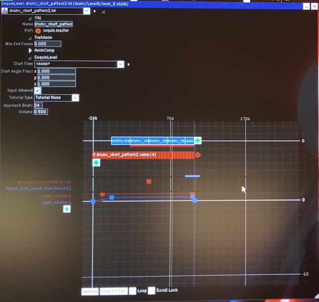

# .lvl Objects
For [level .objlib files](objlib_level_structure.md), a .lvl Object roughly corresponds to a regular (non-boss) sub-level in the game. In some cases, a .lvl Object is part of a regular sub-level or boss section. Each .lvl Object is made up of one or more patterns called "[.leaf Objects](leaf.md)". Sample loops with volume envelopes and one-off SFX can be defined in a .lvl Object.

Here is a screenshot of [Drool's Editor](drools_editor.md) showing the .lvl Object named `drums_short_pattern2.lvl`, from `levels/Level6/level_6.objlib`.

Each sequin .objlib file contains a .lvl Object named root.lvl, which is usually used to define a sequence of animations.

## Parameter List
The following is a list of known [parameters](object_param_selectors.md) belonging directly to a .lvl Object.

| Value (little-endian) | Parameter Name | Meaning |
| --------------------- | -------------- | ------- |
| `e04f3144`            | layer_volume   | Controls the volume of a sample loop in a .lvl Object. The allowed values for volume \\(A\\) are: \\(A \in \mathbb{R} \vert 0 \leq A \leq 1 \\). |

## Format
### Header
| Length | Data Type                    | Meaning   |
| ------ | ---------------------------- | --------- |
| 4      | [int32](data_types.md#int32) | *Unknown* |
| 4      | [int32](data_types.md#int32) | *Unknown* |
| 4      | [int32](data_types.md#int32) | *Unknown* |
| 4      | [int32](data_types.md#int32) | *Unknown* |

### Approach Animation Definition
*Unknown*

### Main Definition
| Length | Data Type | Meaning |
| ------ | --------- | ------- |
| 4 | N/A | Section marker. `3c8efb12` = Unknown |

### Sequencer Objects section
| Length | Data Type | Meaning |
| ------ | --------- | ------- |
| 4 | [int32](data_types.md#int32) | Number of [Sequencer Objects](seqin_objects.md) in this object |

See [Sequencer Objects](seqin_objects.md) for the format of each Sequencer Object.
#### .leaf Sequence section
*Unknown*

#### Loops section
*Unknown*

### Footer
| Length | Data Type | Meaning |
| ------ | --------- | ------- |
| 1 | [bool](data_types.md#bool) | *Unknown* |
| 4 | [float32](data_types.md#float32) | *Unknown* |
| 4 | [int32](data_types.md#int32)? | *Unknown* |
| 4 | [int32](data_types.md#int32)? | *Unknown* |
| variable | [string](data_types.md#string) | *Unknown* |
| 1 | [bool](data_types.md#bool) | *Unknown* |
| 17 | [string](data_types.md#string) | *Unknown* |
| 12 | [vector3f](data_types.md#vector3f) | *Unknown* |