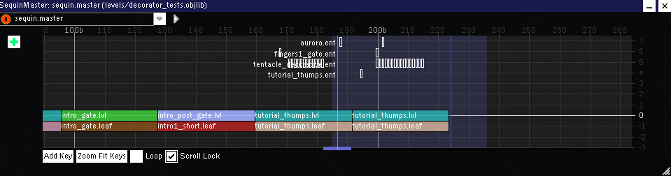

# .master Objects
A .master Object is the sequence master of a level .objlib file, defining the order of all [.lvl Objects](lvl.md) and [.gate Objects](gate.md) within that file. Each level .objlib file has exactly one .master Object.

A screenshot of [Drool's Editor](drools_editor.md) with a .master Object open is shown below.

## Format

### Header
| Length | Data Type                    | Meaning   |
| ------ | ---------------------------- | --------- |
| 4      | [int32](data_types.md#int32) | *Unknown* |
| 4      | [int32](data_types.md#int32) | *Unknown* |
| 4      | [int32](data_types.md#int32) | *Unknown* |
| 4      | [int32](data_types.md#int32) | *Unknown* |

### Animation Definition
*Unknown*

### Main Definition
| Length | Data Type | Meaning |
| ------ | --------- | ------- |
| 4 | N/A | Section marker. `3c8efb12` = Unknown |
| 4 | [int32](data_types.md#int32)? | *Unknown* |
| 4 | [float32](data_types.md#float32) | *Unknown* |
| variable | [string](data_types.md#string) | *Unknown* |
| variable | [string](data_types.md#string) | Intro [.lvl](lvl.md) object name. This is the first [.lvl](lvl.md) Object in a level, before other [.lvl](lvl.md)/[.gate](gate.md) Objects defined below. |
| 4 | [int32](data_types.md#int32) | Number of groupings of [.lvl](lvl.md)/[.gate](gate.md) Objects. Each grouping contains either a [.lvl](lvl.md) Object or a [.gate](gate.md) Object, but not both. |

#### For Each Grouping
| Length   | Data Type | Meaning |
| -------- | --------- | ------- |
| variable | [string](data_types.md#string) | [.lvl](lvl.md) object name |
| variable | [string](data_types.md#string) | [.gate](gate.md) object name |
| 1 | [bool](data_types.md#bool) | Checkpoint. If this is set to `1`, a checkpoint is placed after the [.lvl](lvl.md)/[.gate](gate.md) Object; if this is set to `0`, no checkpoint is placed. |
| variable | [string](data_types.md#string) | Checkpoint leader [.lvl](lvl.md) object name. (To be confirmed): If this is non-empty, this represents the [.lvl](lvl.md) Object placed before the [.lvl](lvl.md)/[.gate](gate.md) Object, typically a short rest between the last checkpoint the current [.lvl](lvl.md)/[.gate](./gate.md) object. |
| variable | [string](data_types.md#string) | Rest [.lvl](lvl.md) object name. If this is non-empty, this represents the [.lvl](lvl.md) Object placed before the [.lvl](lvl.md)/[.gate](gate.md) Object, typically a long rest between sub-levels. |
| 7 | Unknown | *Unknown* |
| 1 | [bool](data_types.md#bool) | PLAY +. If this is set to `1`, this [.lvl](lvl.md)/[.gate](gate.md) Object is present in the PLAY + mode of the level; if this is set to `0`, this [.lvl](lvl.md)/[.gate](gate.md) Object is omitted from the PLAY + mode.

### Footer
| Length   | Data Type                        | Meaning   |
| -------- | -------------------------------- | --------- |
| 1        | [bool](data_types.md#bool)       | *Unknown* |
| 1        | [bool](data_types.md#bool)       | *Unknown* |
| 4        | [int32](data_types.md#int32)     | *Unknown* |
| 4        | [int32](data_types.md#int32)     | *Unknown* |
| 4        | [int32](data_types.md#int32)     | *Unknown* |
| 4        | [int32](data_types.md#int32)     | *Unknown* |
| 4        | [float32](data_types.md#float32) | *Unknown* |
| 4        | [float32](data_types.md#float32) | *Unknown* |
| 4        | [float32](data_types.md#float32) | *Unknown* |
| variable | [string]( data_types.md#string)  | *Unknown* |
| variable | [string]( data_types.md#string)  | *Unknown* |